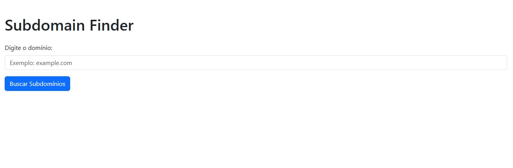
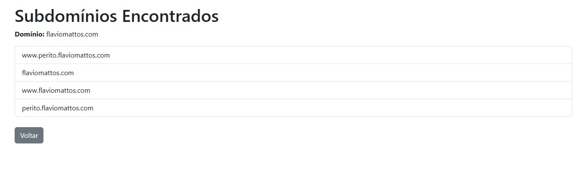
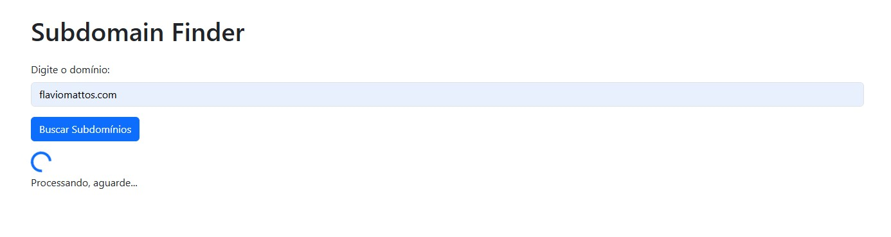

# Subdomains Finder

This program discovers subdomains of a given domain using powerful enumeration tools like **Amass**. It provides a web-based interface to analyze and log subdomains for security assessments.

## Features
- 🌐 **Web Interface**: Enter a domain and view subdomains found, presented in a clean and user-friendly layout.
- 📄 **Logs**: All scanned domains are logged for future reference.
- 🛠️ **Modern Design**: Built with Flask and styled using Bootstrap for a responsive and modern look.

## Screenshots

### Main Page


### Loading Spinner


### Results Page


---

## Installation

1. **Clone the repository**:
   ```bash
   git clone git@github.com:oflaviomattos/subdomains_finder.git
   cd subdomains_finder

2. **Install dependencies**:
   ```bash
   pip3 install -r requirements.txt

3. **Run the application**:
   ```bash
   python3 app.py

## Technologies Used

- **Python**: Powered by the Flask framework to create a lightweight and scalable web application.
- **Amass**: Utilized for powerful subdomain enumeration and discovery.
- **Bootstrap**: Ensures a modern, responsive, and user-friendly design.
- **HTML/CSS/JavaScript**: Provides the structure, styling, and interactivity for the web interface.

---

## Contribution

Contributions are welcome! 🎉  
If you'd like to contribute:
1. Fork this repository.
2. Create a new branch with your feature or fix:
   ```bash
   git checkout -b feature/your-feature-name


---

### Author

Developed by [**Flavio Mattos**](https://github.com/oflaviomattos).  
Feel free to connect with me on GitHub to explore more of my work!
